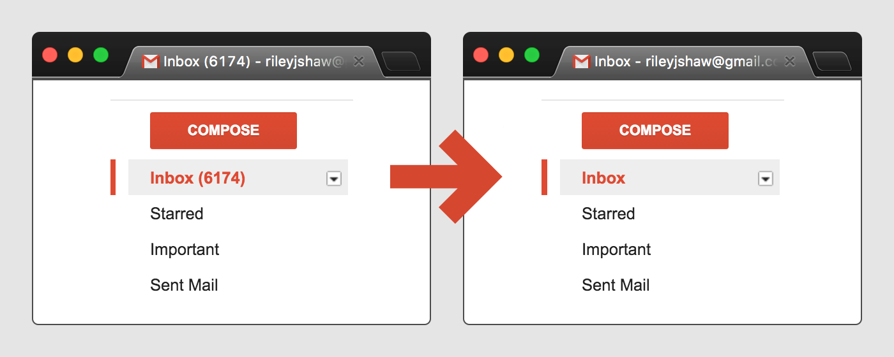

# Easy Inbox Zero (deprecated)

**Update 2020: this extension is no-longer on the Chrome or Firefox web stores. Any app that has email permissions should have a proper privacy policy. My silly app does not have one of those.**

**Rest assured that this this extension never, _ever_ saved any user data or sent analytics.**

For the determined, you can still run the extension locally. Here are some instructions for [Chrome](https://support.google.com/chrome/a/answer/2714278?hl=en) and [Firefox](https://developer.mozilla.org/en-US/docs/Mozilla/Add-ons/WebExtensions/Your_first_WebExtension#Trying_it_out) that worked as of early 2020.

The original README follows:

---

_Achieve coveted Inbox Zero status without actually doing anything._

~A [Chrome extension](https://chrome.google.com/webstore/detail/cljdnejdgbfjcpodbahcofcbofleelne/)[1](#f1).~

This extension removes the unread count from your Gmail inbox and title bar. You can even target specific folders!

## Usage
By default, the unread count for your “Inbox” folder is hidden. To change which folders are hidden, click Options under the More Tools > Extensions page.

---

~<b name="f1">1:</b> Will also run on Firefox as soon as [WebExtensions support](https://wiki.mozilla.org/WebExtensions/RoadMap#Timeline) ships.~
